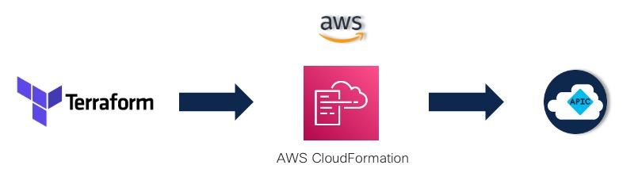
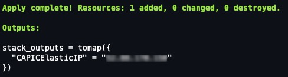
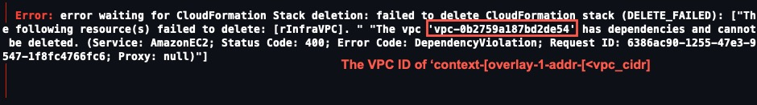

# Example Terraform Plan to deploy Cisco Cloud Application Policy Infrastructure Controller on AWS

This is an example terraform manifest that uses the terraform resource **aws_cloudformation_stack** to deploy the Cisco Cloud Application Policy Infrastructure Controller (cAPIC) using the provided CloudFormation template published on the AWS Marketplace.

## Table of Content
- [Pre-Requirements](#pre-requirements)
   - [AWS Requirements](#aws-requirements)
      - [AWS Accounts](#aws-accounts)
      - [AWS EC2 Key Pair](#aws-ec2-key-pair)
      - [AWS CLI](#aws-cli)
   - [Cloud ACI Subscription](#cloud-aci-subscription)
- [Installation](#installation)
- [Usage](#usage)
   - [TFVARS Definition](#tfvars-definition)
   - [Execution](#execution)
   - [Terraform Destroy](#terraform-destroy)
- [Contributors](#contributors)
- [Terraform Details](#terraform-details)
   - [Requirements](#requirements)
   - [Providers](#providers)
   - [Modules](#modules)
   - [Inputs](#inputs)
   - [Outputs](#outputs)

## Pre-Requirements

### AWS Requirements
#### AWS Accounts

Cisco Cloud APIC requires the following AWS accounts:
- AWS Account to host Cloud APIC EC2 instances
- An AWS Accout for each tenant to be deployed with Cloud APIC. Configuration of these tenants are not in the scope of this example but to see the full operation of cAPIC supporting user tenants this requirement is needed.

#### AWS EC2 Key Pair

As part of the deployment a EC2 Key pair is required. Create this key pair prior to executing the terraform deploy. As part of the step-by-step instructions this key pair will be referenced in the variables. For instructions on creating a key pair refer to the following AWS support article.

[Create a key pair using Amazon EC2](https://docs.aws.amazon.com/AWSEC2/latest/UserGuide/create-key-pairs.html)

*Note: AWS Key Pairs are region specific so be sure to create the key pair in the same AWS region you plan to deploy the cAPIC.*

#### AWS CLI

The Terraform AWS Provider has various configuration for authentication. Refer to the following for configuring authentation for the AWS provider. [Terraform AWS Provider Documentation](https://registry.terraform.io/providers/hashicorp/aws/latest/docs#authentication-and-configuration).

This example uses named profiles configured with the AWS CLI. This allows the credentials for the AWS account to be stored away from the repo and makes it easy to pick the tenant based on the named profile. Refer to this link for details, [Named Profiles for AWS CLI](https://docs.aws.amazon.com/cli/latest/userguide/cli-configure-profiles.html).

### Cloud ACI Subscription

To use this CloudFormation stack you must access the AWS Marketplace and subscribe and accept the terms and conditions prior to executing the apply, failure to do so will cause the execution to run for approximately 10 minutes then fail on deployment of the cAPIC Instance and roll back the stack deployment.

Visit the following url to view details about Cisco cAPIC on the AWS Marketplace to subscribe.

[AWS Marketplace - Cisco Cloud Application Policy Infrastructure Controller](https://aws.amazon.com/marketplace/pp/prodview-2ik24m2crp3h4?sr=0-13&ref_=beagle&applicationId=AWSMPContessa)

## Installation

- Terraform 1.1.0 or later must be installed [HashiCorp - Install Terraform](https://learn.hashicorp.com/tutorials/terraform/install-cli)

Clone or fork the repository to the local machine.
```
git clone https://github.com/rjohnston6/aws_capic_tf_example.git
```
## Usage

#### TFVARS Definition

Once the repository is cloned complete the following to create a variables file to be used during execution. Included in the repository is an example `tfvars` file `terrafrom.tfvars.example`. 

*Note: As part of the `.gitignore` files with a `.tfvars` are ignored to ensure variables are note stored in version control. If the `.gitignore` is updated or changed or removed special care must be taken to ensure secrets such as passwords are not stored in version control.*

The following steps outline how to update the file for use during execution.
1. Rename `terraform.tfvars.example` to `terraform.tfvars`
2. Edit the renamed file with the following
   * Set the `aws_credential_profile` with the name of the profile defined using the aws cli for the infrastructure tenant.
   * Set the `aws_region` for the AWS region where cAPIC will be deployed, for example `us-west-2` for the Oregon region.
   * Set the `pAvailabilityZone` for the Availability Zone to deploy cAPIC to, as per installation instructions for cAPIC if the region has multiple availability zones choose the lowest availability zone this will normally be `a` for example `us-west-2a` the Oregon region.
   * Set the `pPassword` to the desired password for authentication to cAPIC web interface.
   * Set the `pKeyName` to the name of the previously defined EC2 key pair as outlined in the pre-requirments. Remember the Key Pair must be present in the intended region where cAPIC will be deployed.
   * (**Optional**) Set the `pExtNw` to the subnet permitted to access the cAPIC. For demonstarations a value of `"0.0.0.0/0"` will allow access from any IP address globably. This may be sufficent for demonstations but ensure to follow your organizations CyberSecurity requirements that may dictate differently workloads.
3. Additional variables can be added to the tfvars to override the defaults defined in the variable defaults. See the section ["Terrafrom Details - Inputs"](#inputs) for all variables and thier defaults.
4. Save the updated `terraform.tfvars` file.

#### Execution



Use the following steps to initalize, plan and deploy using terraform cli. Once deployed the assigned public IP address for the cAPIC will be provided.

1. From a terminal change directories to the root of the cloned repo.
2. Initialize the working directory for terraform by entering `terraform init`
3. Validate the terraform files for any syntax errors by entering `terraform validate`
4. Run a plan to see what will be created by entering `terraform plan`
5. Apply the terraform configuration by entering `terraform apply` optionally to skip answering yes 'terraform apply -auto-approve` can be used.
6. The apply will take a couple minutes to execute, once the complete the IP address for the cAPIC will be displayed. **IMPORTANT** At this point the apply is complete and the instances and resources are deployed and starting up. Wait approximately 10 minutes to allow cAPIC to startup.

At this point cAPIC is deployed and can the GUI can be accessed at:
> https://<outputed_CAPICElasticIP>



#### Terraform Destroy
In the event you would like to undeploy cAPIC, using `terraform destroy` from the directories root will cause terraform to delete the cloud formation stack used during deployment. This will remove a **majority** of the cloud deployed resources in the AWS tenant. It does **NOT** remove all resources. As part of the cAPICs start up there are additional resources configured and must be removed either using the AWS Console, aws cli or other means. These resources are as follows:
- S3 Bucket (capic-xxxx)
- SQS
- CloudTrail
- CloudWatch
- EventBridge

**_NOTE_**:
There are known occurances when issuing `terraform destroy`, the destroy will fail at approximately 15 minutes. The failure reason will be displayed and in most cases will be related to being unable to delete the VPC that was initially created. To resolve this manually, access the AWS console and remove the VPC `context-[overlay-1]-addr-[<vpc_cidr>]` then re-run the terraform destroy.



## Contributors

Special thank you goes to [@github/marinalf](https://github.com/marinalf) for testing and providing feedback along the way! :trophy:

# Terraform Details
<!-- BEGIN_TF_DOCS -->
## Requirements

| Name | Version |
|------|---------|
| <a name="requirement_terraform"></a> [terraform](#requirement\_terraform) | ~>1.1.0 |
| <a name="requirement_aws"></a> [aws](#requirement\_aws) | ~> 3.65.0 |

## Providers

| Name | Version |
|------|---------|
| <a name="provider_aws"></a> [aws](#provider\_aws) | 3.65.0 |

## Modules

No modules.

## Resources

| Name | Type |
|------|------|
| [aws_cloudformation_stack.capic_stack](https://registry.terraform.io/providers/hashicorp/aws/latest/docs/resources/cloudformation_stack) | resource |

## Inputs

| Name | Description | Type | Default | Required |
|------|-------------|------|---------|:--------:|
| <a name="input_aws_credential_profile"></a> [aws\_credential\_profile](#input\_aws\_credential\_profile) | Set credential profile for aws cli if not using default | `string` | `"default"` | no |
| <a name="input_aws_region"></a> [aws\_region](#input\_aws\_region) | AWS Region for resource deployment | `string` | `"us-east-1"` | no |
| <a name="input_capic_stack_name"></a> [capic\_stack\_name](#input\_capic\_stack\_name) | CloudFormation deployment stack name | `string` | `"capic-stack"` | no |
| <a name="input_capic_template_url"></a> [capic\_template\_url](#input\_capic\_template\_url) | CloudFormation template URL for CAPIC | `string` | `"https://s3.amazonaws.com/awsmp-fulfillment-cf-templates-prod/6cad9a0e-821a-4f03-881e-fb1f66f4dc1f/c636799095224e63a6074ca3308fe27f.template"` | no |
| <a name="input_pAssignOOBIntfEIP"></a> [pAssignOOBIntfEIP](#input\_pAssignOOBIntfEIP) | Select whether to assign public IP address to oob management interface or not. | `string` | `"true"` | no |
| <a name="input_pAvailabilityZone"></a> [pAvailabilityZone](#input\_pAvailabilityZone) | Availability zone for Cloud APIC (Must select lexicographically lowest Availability zone) | `string` | `"us-east-1a"` | no |
| <a name="input_pExtNw"></a> [pExtNw](#input\_pExtNw) | External network allowed to access Cloud APIC (x.x.x.x/x). Configuring external subnet with 0.0.0.0/0 is a SECURITY RISK, it is advisable to use specific subnet. | `string` | n/a | yes |
| <a name="input_pFabricName"></a> [pFabricName](#input\_pFabricName) | Fabric Name (must be only alphanumeric chars separated by '-') | `string` | `"ACI-Cloud-Fabric"` | no |
| <a name="input_pInfraVPCPool"></a> [pInfraVPCPool](#input\_pInfraVPCPool) | IP address pool for Infra VPCs (must be a /24 prefix) | `string` | `"10.10.0.0/24"` | no |
| <a name="input_pInstanceType"></a> [pInstanceType](#input\_pInstanceType) | Select one of the possible EC2 instance types | `string` | `"m5.2xlarge"` | no |
| <a name="input_pKeyName"></a> [pKeyName](#input\_pKeyName) | Name of an existing SSH KeyPair to enable SSH access to Cloud APIC | `string` | n/a | yes |
| <a name="input_pPassword"></a> [pPassword](#input\_pPassword) | Admin Password for Cloud APIC | `string` | n/a | yes |

## Outputs

| Name | Description |
|------|-------------|
| <a name="output_stack_outputs"></a> [stack\_outputs](#output\_stack\_outputs) | Outputs from the Stack execution |
<!-- END_TF_DOCS -->
